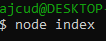
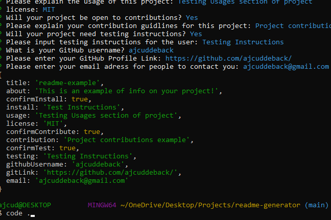
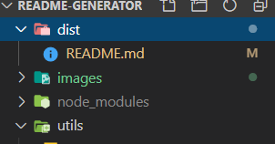

# README Generator

## Description

This project will generate a high quality README.md file you can copy to your GitHub project based on CLI prompts.

## Table of Contents

- [Installation](#installation)
- [Usage](#usage)
- [Instructions](#instructions)
- [License](#license)
- [Questions](#questions)

## Installation

In order to install this project you must clone this project on to your local machine.

## Usage

This project usage is for anyone that needs a high quality README.md file for their own GitHub Project!

## Instructions

- Step 1: Clone this repository

* 

- Step 2: Run 'node index' in the terminal while in root directory of the cloned project

* 

- Step 3: Answer the prompts

- Step 4: Once you finish answering the prompts type 'code .' in the terminal

* 

* Step 5: Navigate to the dist folder

* 

- Step 6: Your high-quality readme file is located in the dist folder where you can copy it into your project!

## License

- This application is covered under the MIT license

## Questions

Created by: [ajcuddeback](https://github.com/ajcuddeback)

If you have any further questions please feel free to contact me at [ajcuddeback@gmail.com](ajcuddeback@gmail.com)
